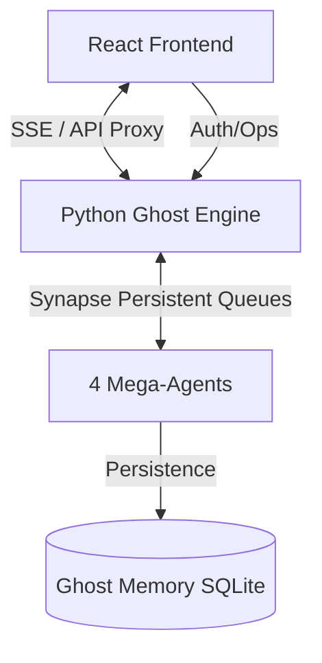

# Sentient Alpha - Project Blueprint & Architecture

## 1. Project Manifesto

**Project Name:** Sentient Alpha Trading Bot
**Objective:** Autonomous, multi-phase trading system leveraging AI agents to analyze, debate, and execute trades on Kalshi.
**Core Philosophy:**

- **Modular Intelligence:** 4 specialized Mega-Agents (Soul, Senses, Brain, Hand) providing a robust, self-healing core.
- **2-Tier Architecture:** High-performance Python Engine for all logic, AI, and streaming <--> React Frontend for real-time visualization and control.
- **Safety First:** Strict distinct phases (Surveillance -> Intelligence -> Execution -> Protection) with automated Veto safeguards and the "Ragnarok" liquidation protocol.

## 2. System Architecture

### High-Level Data Flow

### Components

1.  **Frontend (`/frontend`)**:
    - **Tech**: React, Vite, Zustand (State), Shadcn UI (Components), TailwindCSS.
    - **Role**: Real-time visualization of the "Brain", Terminal logs, PnL tracking, and Manual Override.
    - **Sync Status**: Connects directly to Engine port 3002 via SSE (`/stream`) and REST API.
2.  **Engine (`/engine`)**:
    - **Tech**: Python 3.12, Asyncio, Aiohttp (Web Server), SQLite (Synapse).
    - **Role**: The "Executive Collective". Orchestrates the full lifecycle via decoupled agents.
    - **Core**: **Synapse** (Persistent Queues) ensures zero data loss during restarts/crashes.
    - **Control**: **SoulAgent** manages the autonomous trade pulse (Autopilot) via the `/autopilot` endpoints.
    - **API**: Serves `/auth`, `/trigger`, `/cancel`, `/pnl`, `/autopilot/*`, and `/stream`.
3.  **Shared (`/shared`)**:
    - **Tech**: TypeScript.
    - **Role**: Shared Type definitions and Constants. (Note: Python uses manual Dict mirrors, hardening planned).
4.  **Legacy (`/legacy`)**:
    - `backend/`: Deprecated Node.js orchestrator.
    - `dashboard/`: Early prototype.

## 3. Deployment & Ports

| Service      | Port | Tech Stack        |
| :----------- | :--- | :---------------- |
| **Frontend** | 3000 | React + Vite      |
| **Engine**   | 3002 | Python + aiohttp  |

## 4. Current State & Recent Upgrades

- **2-Tier Consolidation**: Removed the middle-man Node.js layer to reduce latency and type desync.
- **Intelligence Core Upgraded**: 
    - Migrated to `google-genai` SDK.
    - Integrated `duckduckgo-search` for real-time market context.
    - Verified Monte Carlo simulation math with unit tests.
- **State Management**: Frontend now uses **Zustand** for a leaner, more responsive state container.

## 5. Coding Standards

1.  **No "Magic Numbers"**: Agent IDs and Phase IDs are standardized across Python and TS.
2.  **Atomic Commits**: UI and Engine changes must be committed together to ensure API compatibility.
3.  **Log Levels**: `INFO`, `WARN`, `ERROR`, `SUCCESS`.
4.  **Safety**: All trades must pass the Brain's simulation AND Hand's capital protection checks.

---

_Updated by Antigravity (Codebase Manager)_
